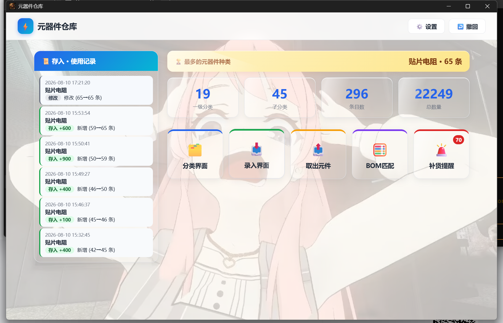
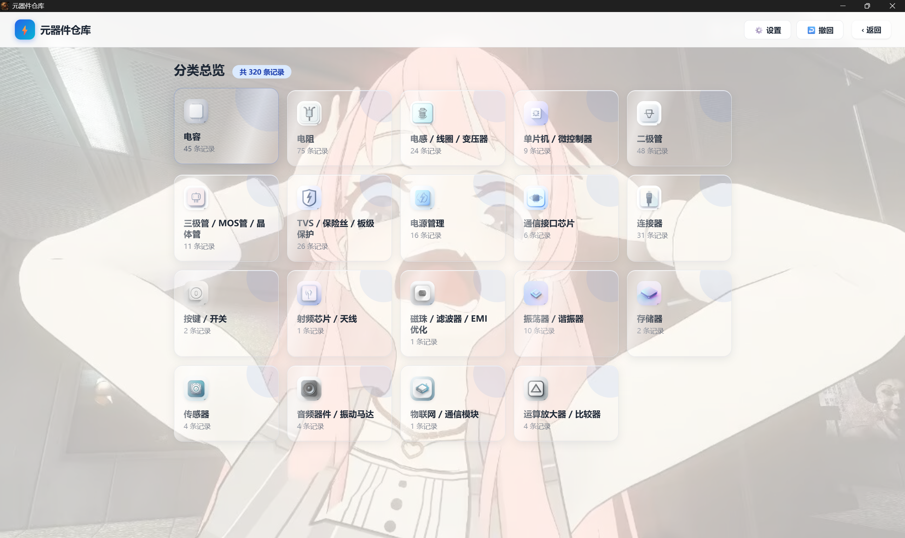
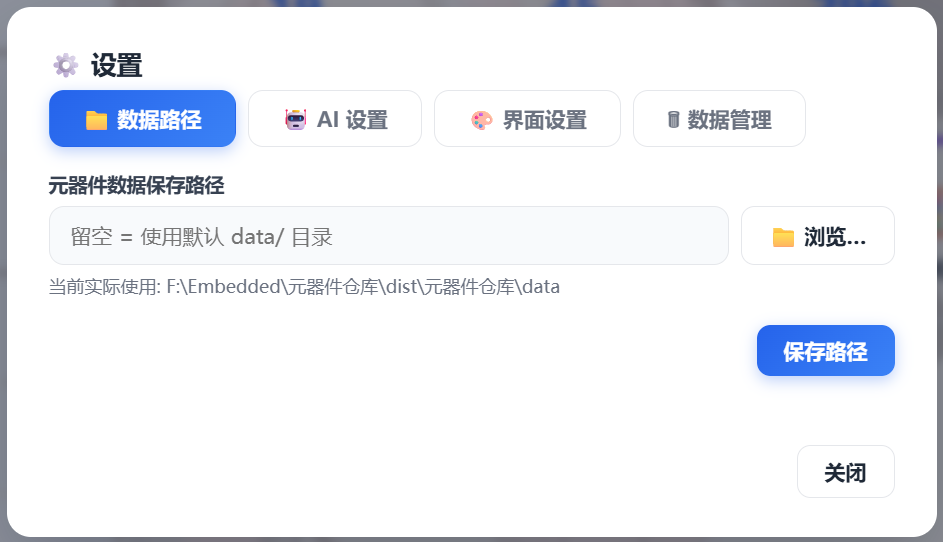
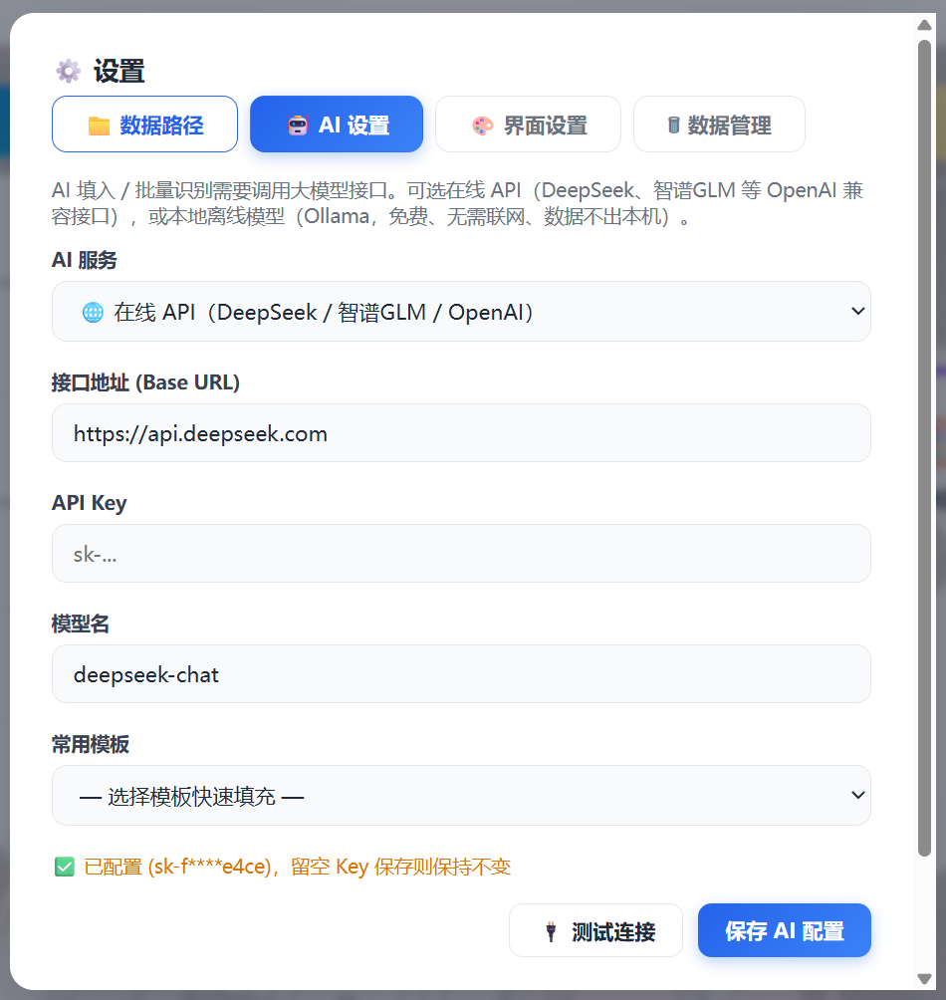
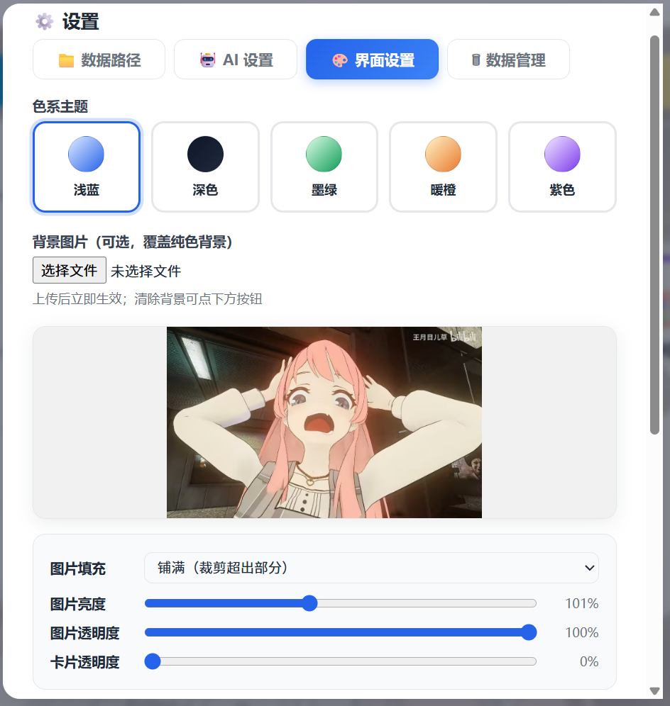
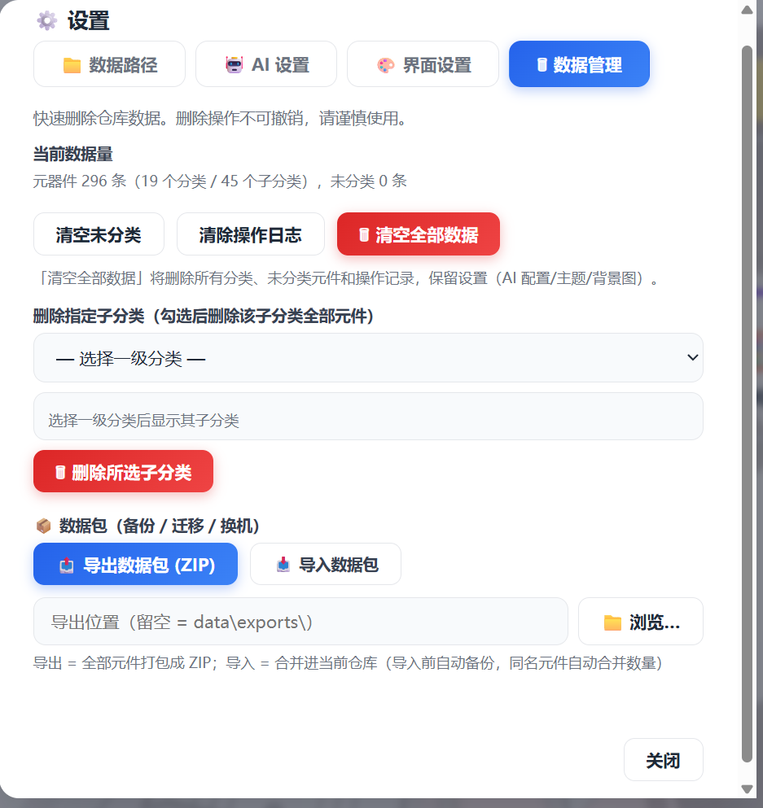

# 元器件仓库 (Parts Warehouse)

本地元器件库存管理工具 —— 数据就是 Excel，所见即所得，AI 帮你录入，BOM 一键匹配取出。

[](https://github.com/Tuang-Gaashuan/parts-warehouse/releases/latest)
[](LICENSE)

> ⬇️ **下载安装包**：[https://github.com/Tuang-Gaashuan/parts-warehouse/releases/latest](https://github.com/Tuang-Gaashuan/parts-warehouse/releases/latest)
> （单文件版 exe 303MB / 完整版 zip 310MB，均为 Windows 双击即用）

- **数据就是 Excel**：每个一级分类一个 `.xlsx`，无数据库，用 WPS/Excel 直接打开
- **AI 加持但非必须**：一句话描述自动入库、BOM 批量解析；纯规则解析离线也能干
- **36 个一级分类 / 585 个子分类**：参考立创商城商品分类，覆盖常见电子元器件
- **桌面 + 浏览器双形态**：pywebview 原生窗口或纯 Web 页面

## 界面预览

大厅 —— 分类卡片总览，只显示有记录的分类：



分类界面 —— 表格直接编辑、按数值排序、搜索过滤：



录入 —— 批量导入（Excel / TXT）与摄像头拍照入库：

<p align="center">
  
  
</p>

设置 —— 主题色系、背景图、AI 接口、数据路径：

<p align="center">
  
  
  
  
</p>

## 发布包内容

本仓库提供三种使用形态，按需选择：

| 形态 | 文件 | 体积 | 适合 |
| --- | --- | --- | --- |
| 单文件版 | `parts-warehouse.exe` | 303MB | 想一个文件拿走就用，双击即开（首次运行稍慢，需解压） |
| 完整版 | `parts-warehouse-full.zip` | 310MB | 解压后运行，启动快，适合固定电脑长期用 |
| 源码 | `parts-warehouse-src/` | 8MB | 开发者：看实现、改代码、自己打包 |

两种 exe 功能完全一样（单文件版 = 完整版的压缩形态），都不需要安装 Python。

## 快速开始

1. 下载 `parts-warehouse.exe`（或解压完整版）到任意目录
2. 双击运行 —— 首次启动自动在 exe 旁边生成 `data\` 目录（含示例数据）
3. 开始录入：手动填表 / `✦ AI 填入` 一句话入库 / 拍照 OCR 入库 / BOM 批量导入

数据永远在 `data\` 目录，重装、升级都不丢；复制 `data\` 即备份。

## 功能一览

| 功能 | 说明 |
| --- | --- |
| 库存总览 | 分类卡片总览，只显示有记录的分类 |
| AI 填入 | 「100个 0805 10K ±1% 贴片电阻」→ 自动解析成结构化数据 |
| 批量导入 | 粘贴文本 / 上传 Excel，AI 或纯规则解析（位号防护、NC 剔除） |
| BOM 匹配取出 | 导入 BOM 自动匹配库存，精确/相似/不足/缺料四色状态，按需扣减 |
| 未分类区 | 无法判断归属的元件自动进未分类区，手动归类 |
| OCR 拍照入库 | 摄像头拍照 / 图片识别（RapidOCR 离线），AI 整理后一键入库 |
| 数据包 | ZIP 一键导出/导入全部数据，换机迁移、备份 |
| 撤销 | 导入、取出、修改均可一键撤回 |
| 低库存预警 | 数量低于阈值（默认 10）的元件清单 |

## AI 功能（可选）

打开「设置 → AI」：

- **在线 API**：DeepSeek、智谱 GLM 等任意 OpenAI 兼容接口，填 base_url / API Key / model 即可
- **本地离线（Ollama）**：免费离线，数据不出本机（`ollama pull qwen2.5:7b`）

不配 AI 也能用：手动录入、纯规则批量导入、拍照入库的 `--no-ai` 模式都不依赖 AI。

## 开发者

源码在 `parts-warehouse-src/`（独立 git 仓库），README、目录结构、打包方法见其中：

```bash
git clone <本仓库>
cd parts-warehouse-src
pip install -r requirements.txt
python seed.py      # 可选：生成示例数据
python desktop.py   # 桌面版
python app.py       # 浏览器版 http://127.0.0.1:5000
```

打包：`python pack.py`（自动备份数据 → 打包 → 更新 dist/），详见 src 内 README。

## 数据安全

- 所有数据 = `data\` 目录下的 xlsx，复制即备份
- 打包/导入数据包前自动备份到 `backups\`
- 本发布包**不含任何用户数据**，首次运行自动生成干净数据目录

## License

MIT © 2026 Tuang-Gaashuan
