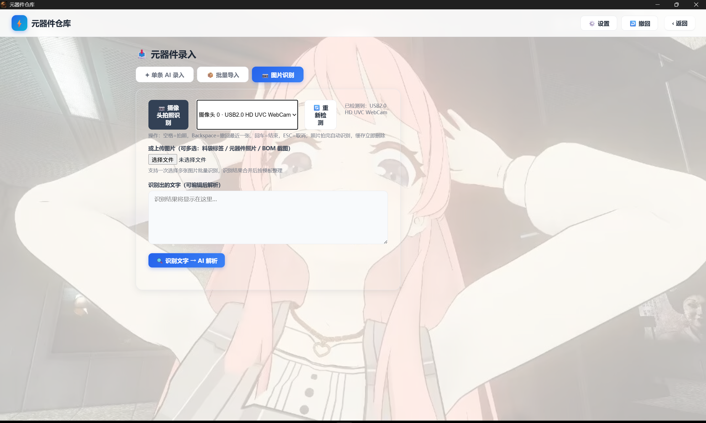

# 元器件仓库 (Parts Warehouse)

本地元器件库存管理工具 —— 每个分类一个 Excel 文件，所见即所得，可手动编辑，也可 AI 快速录入。

- **数据就是 Excel**：无数据库，每个一级分类一个 `.xlsx`，改个文件就能导入导出、随时用 WPS/Excel 打开
- **桌面 + 浏览器双形态**：pywebview 原生窗口（无地址栏）或纯 Web 页面
- **AI 加持但非必须**：自然语言一键入库、BOM 批量解析；纯规则解析也能离线干活，AI 只是加速器
- **36 个一级分类 / 585 个子分类**：参考立创商城商品分类，覆盖常见电子元器件

## 功能一览

| 功能 | 说明 |
| --- | --- |
| 库存总览 | 分类卡片总览，只显示有记录的分类，一目了然 |
| 表格编辑 | 直接点单元格编辑，支持排序（阻容感按数值排序，1MΩ 排在 10kΩ 前面） |
| AI 填入 | 一句话描述 → AI 解析成结构化字段入库，如「100个 0805 10K ±1% 贴片电阻」 |
| 批量导入 | 粘贴文本 / 上传 Excel，AI 或纯规则解析（位号防护、NC 剔除、电容值规范化） |
| BOM 匹配取出 | 导入 BOM 自动匹配库存，精确/相似/不足/缺料四色状态，按需扣减库存 |
| 未分类区 | AI 无法判断归属的元件自动进未分类区，手动归类 |
| OCR 拍照入库 | 摄像头拍照或图片识别（RapidOCR 离线识别料袋标签），AI 整理后一键入库 |
| 数据包 | ZIP 一键导出/导入全部数据，换机迁移、分享、备份都靠它 |
| 撤销 | 导入、取出、修改均可一键撤回（带操作流水） |
| 仪表盘 | 库存总量统计、最近操作记录 |
| 品牌库 | 按品牌聚合采购记录（品牌 / 业务 / 采购量），同品牌多写法自动合并，可导出 Excel、生成 data/品牌库.xlsx 档案 |
| 低库存预警 | 数量低于阈值（默认 10）的元件清单 |
| 设置 | 主题色系、背景图、数据目录、AI 接口，全部界面化 |

## 界面预览



## 快速开始

### 方式一：直接下载打包版（推荐）

从 Releases 下载 `parts-warehouse.exe`，双击即用：

- 首次运行会在 exe 旁边自动生成 `data\` 目录（含示例数据）
- 数据永远在 `data\` 目录，重装、重打包都不丢数据
- 依赖 Windows 10/11 自带 WebView2（Edge 内核，通常已预装）

### 方式二：源码运行

需要 Python 3.10+：

```bash
git clone https://github.com/<你的仓库地址>.git
cd parts-warehouse
pip install -r requirements.txt
python seed.py      # 可选：生成示例数据（会清空 data/，正式使用后勿跑）
python desktop.py   # 桌面窗口版
# 或
python app.py       # 纯浏览器版 (http://127.0.0.1:5000)
```

Windows 下直接双击 `start.bat` 也可（源码版入口）。

> 可选依赖说明：`opencv-python` 用于摄像头拍照入库、`rapidocr` 用于图片文字识别，
> 不安装不影响其它功能，只是这两个功能不可用。

## AI 功能配置

AI 用于「自然语言解析入库」「批量导入解析」「OCR 结果整理」，支持任意 OpenAI 兼容接口。

打开「设置 → AI」，二选一：

### 在线 API（DeepSeek / 智谱 GLM 等）

| 项 | 说明 |
| --- | --- |
| 接口地址 | 如 `https://api.deepseek.com`、`https://open.bigmodel.cn/api/paas/v4`（自动兼容 /v1、/v4 写法） |
| API Key | 在对应平台申请，仅存本机 `data/settings.json` |
| 模型 | 如 `deepseek-chat`、`glm-4-flash`（免费额度） |

也可以不填 Key，改用环境变量：

```bash
export DEEPSEEK_API_KEY=sk-xxxx
export DEEPSEEK_BASE_URL=https://api.deepseek.com   # 可选，默认 deepseek
```

### 本地离线（Ollama）

完全免费离线，数据不出本机：

```bash
# 安装 Ollama 后拉取模型
ollama pull qwen2.5:7b
```

设置页选「本地离线 (Ollama)」，自动探测已装模型，无需 API Key。

> 纯规则解析（批量导入 → 纯规则模式、rk 的 `--no-ai`）完全不依赖 AI，任何环境都能用。

## 使用说明

### 总览页

36 个一级分类卡片，只显示有记录的分类；顶部搜索框全局过滤；卡片右下角是当前分类元件总数。

### 分类详情页（表格）

- 点击单元格直接编辑，绿色「保存」按钮写回 Excel
- `+ 新增行` 添加空行；表头点击排序（▲/▼ 指示，阻容感按数值大小排序）
- 底部显示该分类合计数量
- `导出` 当前分类为独立 xlsx

### 新增/入库

- 手动：`+ 新增行` 逐行填写，或直接在 Excel 里改
- AI：`✦ AI 填入`，输入自然语言描述，如：

  ```
  100个 0805 10K ±1% 贴片电阻 富信
  10片 STM32F103C8T6 LQFP48 MCU
  1K@35V 铝电解 直插 20个
  ```

  位号（C1、R2、U5）不会被当成型号；电容只把容值当名称，耐压/材质进规格参数。

- 批量：导入页粘贴文本或上传 Excel（支持嘉立创导出的 BOM），选 AI 或纯规则解析，预览确认后提交
- 拍照：摄像头拍照或选择图片 → OCR 识别 → AI 整理 → 确认入库

### BOM 匹配与取出

导入 BOM 后自动与库存匹配，每个料号给出四色状态：

| 状态 | 含义 |
| --- | --- |
| ✅ 充足 | 库存精确匹配，数量够 |
| ⚠️ 可替代 | 精确不够，但相似料（同值不同封装/品牌等）可补足 |
| ⚠️ 不足 | 差 N 个 |
| ❌ 缺料 | 无任何候选，需采购（自动汇总到「需要采购」清单） |

确认后按分类批量扣减库存，扣减可撤销。型号类元件严格匹配（SS34 不会匹配成 SS36）。

### 未分类区

AI/OCR 解析后无法确定归属一级分类的元件会进入未分类区，提供候选项一键归类，也可手动指定分类与子分类。

### 数据包（备份 / 迁移 / 分享）

「数据包 → 导出」把全部数据打包成 ZIP（含设置、背景图）；「导入」一键恢复。

换电脑：导出 → 拷贝 ZIP → 新电脑导入。分享仓库模板：导出后清空数据即可。

### 撤销与流水

每次导入/取出/保存都有记录，右上角「撤销」可回退最近操作；「仪表盘」可查最近 50 条操作流水。

### 设置

- 主题：浅蓝 / 深色 / 绿 / 橙 / 紫
- 背景图：上传本地图片，可调亮度/透明度/填充方式（封面、平铺、原始尺寸）
- 数据目录：默认 `程序目录/data`，可改到任意位置（改完重启生效）
- AI：见上文「AI 功能配置」

## 命令行工具 rk（拍照入库）

项目自带一个 CLI 拍照/图片入库工具，适合有摄像头的台式机/笔记本快速录入料袋：

```bash
./rk                     # 打开摄像头拍照入库 (空格=拍照 回车=结束 Backspace=撤回)
./rk a.jpg b.jpg         # 指定图片文件入库
./rk -d ./袋料照片        # 处理目录下所有图片
./rk --no-ai             # 纯规则解析, 无需 AI/key/网络 (适合固定格式料袋)
./rk -y                  # 跳过逐条确认直接入库
./rk --device 0          # 摄像头编号 (默认 1)
```

流程：拍照/图片 → OCR 识别 → AI 按料袋模板整理 → 解析分类 → 逐条确认 → 入库。
入库复用主程序全部质量红线（位号防护 / NC 剔除 / 电容规范化 / 重复合并 / 未分类区 / 可撤销）。

## 数据存储

所有数据在 `data/` 目录（打包版在 exe 旁边，源码版在项目目录）：

```
data/
├── settings.json        # 设置 (数据路径 / 主题 / AI 配置)
├── activity_log.jsonl   # 操作流水
├── undo_log.jsonl       # 撤销历史
├── backgrounds/         # 背景图
├── exports/             # 数据包导出
└── <分类>.xlsx          # 每个一级分类一个文件 (如 电容.xlsx)
```

统一表头：

    名称/型号 | 品牌 | 封装 | 数量 | 库位 | 子分类 | 规格参数 | 数据手册链接 | 备注

**备份 = 复制 data/ 目录**，或使用「数据包导出」。

## 分类体系定制

分类定义在 `warehouse/config.py`（36 个一级分类 + 子分类列表），改完重启生效：

- 一级分类 = 一个 Excel 文件；子分类 = 行内的「子分类」字段
- 同名子分类出现在多个一级分类下时共享同一份物理文件（如「磁珠」同时归属 电感 和 滤波器）
- 新增/修改分类后，用 `python make_catalog.py` 重新生成《category_catalog.xlsx》（纯目录参考，不存元件）

## 打包发布

```bash
python pack.py        # 一键打包 (自动备份数据 → 关闭旧实例 → 打包 → 更新 dist/)
```

产物：`dist/parts-warehouse/parts-warehouse.exe`（数据在 exe 旁，打包不动数据）。
打包前注意：`parts_warehouse.spec` 会把 `data/` 一起打进包内作为示例种子，
如需发布纯净分享版，先清空 `data/`（或运行 `seed.py`）再打包。

## 目录结构

```
parts-warehouse/
├── app.py               # Web 服务 (Flask 后端 + 全部 API)
├── desktop.py           # 桌面版入口 (pywebview 原生窗口)
├── main.py              # 旧版 tkinter 入口 (功能已迁移 Web, 仅保留)
├── rk.py                # 拍照/图片入库 CLI
├── seed.py              # 生成示例数据
├── make_catalog.py      # 生成 category_catalog.xlsx
├── pack.py              # 一键打包脚本 (数据安全版)
├── requirements.txt     # 依赖
├── parts_warehouse.spec # PyInstaller 打包配置
├── start.bat            # 源码版一键启动
├── data/                # 元器件数据 (不入 git)
├── templates/index.html # 前端页面
├── static/              # 前端样式与逻辑 (style.css / app.js / icons)
└── warehouse/           # 后端核心
    ├── config.py        # 分类与字段定义
    ├── excel_store.py   # Excel 读写
    ├── batch_import.py  # 批量导入解析 (AI + 纯规则)
    ├── ai_fill.py       # AI 自然语言解析
    ├── withdraw_match.py# BOM 匹配/扣减库存
    ├── rules.py         # 纯规则解析 (正则, 无 AI)
    ├── packfile.py      # 数据包导入导出
    ├── ocr.py           # 图片文字识别 (RapidOCR)
    ├── undo.py          # 撤销
    ├── activity.py      # 操作流水
    ├── unclassified.py  # 未分类区
    └── settings.py      # 设置读写
```

## 技术栈

Flask + pywebview (WebView2) + openpyxl + RapidOCR (PP-OCRv6) + OpenAI 兼容 AI 接口 / Ollama

## FAQ

**Q: 数据会不会丢？** A: 所有数据都是 `data/` 里的 xlsx，复制目录即备份；每次打包也自动备份。

**Q: 不想用 AI 行不行？** A: 行。手动录入、纯规则批量导入、rk `--no-ai` 都不需要 AI。

**Q: 可以用哪些 AI？** A: 任何 OpenAI 兼容接口：DeepSeek、智谱 GLM、硅基流动、通义、Ollama 本地模型等，设置里填 base_url/key/model 即可。

**Q: 换电脑怎么迁移？** A: 数据包导出 → 拷贝 ZIP → 新电脑导入；或直接复制整个 `data/` 目录。

**Q: 能和其他人协作吗？** A: 把 `data/` 放进网盘/内网共享即可，多人共用一份 xlsx；合并冲突建议用「数据包导入」（自动备份 + 旧名归一化）。

## License

MIT © 2026 Tuang-Gaashuan
